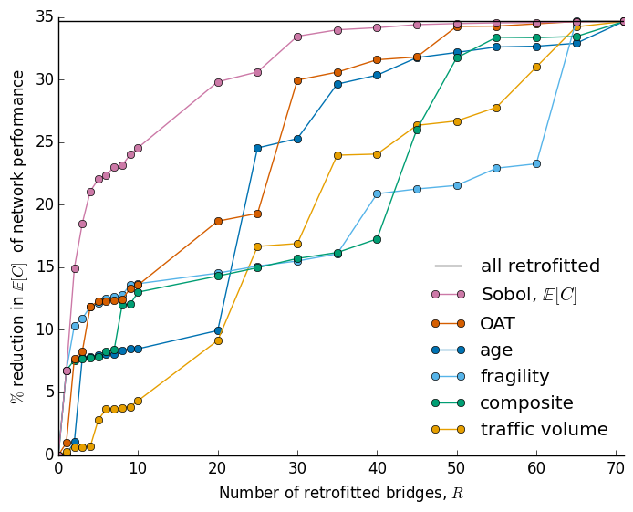

.. |br| raw:: html

=================================================
Identify important components in complex networks
=================================================

What is **sobol**?
==================

Which bridges are the most important to retrofit if we want to reduce the expected cost of the road network
performance?

**sobol** is a repository that contains a set of methods and a sample data set with which to answer that and
similar questions. Specifically, **sobol** comprises:

* | A set of methods for quantifying the importance of individual components in complex networks by computing their
  | first- and total-order Sobol' indices
* | A sample data set on which to use those methods, comprising vector inputs (bridge fragility function
  | parameters) and scalar outputs (the expected cost of road network performance over a set of earthquake rupture
  | scenarios).

Retrofitting bridges based on their total-order Sobol' indices can be more cost efficient than selecting bridges
according to other criteria (Bhattacharjee and Baker TBD).

These methods should be applicable to other networks and performance metrics of interest, provided they meet the
criteria outlined in the paper associated with this repository (Bhattacharjee and Baker TBD).

What are Sobol' indices?
========================

A Sobol' index approximates an exact sensitivity index that results from a global variance-based sensitivity analysis
. The magnitude of a (normalized) Sobol' index indicates how much of the variance in an output quantity of interest
can be attributed to variance in a particular input. The larger the Sobol' index, the more influential the input.

* | For an basic introduction to Sobol' indices, head to the `example <https://github.com/gbhattacharjee/sobol/blob/main/EXAMPLE.rst>`_.
* | For a more detailed treatment, see *Global Sensitivity Analysis: The Primer* by Andrea Saltelli et al.
* | For a detailed treatment of Sobol' indices for bridge retrofit (or component upgrade) prioritisation, see the paper
  | associated with this repository (Bhattacharjee and Baker TBD).

How can I use **sobol**?
========================

Try:

* | Exploring the sample data set to better understand global variance-based sensitivity analysis or Sobol' indices.
* | Replacing the sample data set with your own data, whether for bridges in road networks or for components in another
  | system, and prioritising component-level interventions in your system of interest.
* | Using the methods implemented for computing first- and total-order Sobol' indices for any function of your
  | choosing -- it can be a simple polynomial or not expressible in closed form.

How can I install **sobol**?
============================

In Terminal (on Mac), use the following, replacing [myDirectory] with your preferred directory, e.g. ``cd Desktop``.

| ``cd [myDirectory]``
| ``git clone https://github.com/gbhattacharjee/sobol.git``
|
| Before running any scripts in **sobol**, make sure you have all the required ``Python`` packages in config. Some
packages require specific (earlier) versions, so I recommend creating a virtual environment (e.g., ``venv``) in which
to install them. For example:
|
| ``cd sobol``
| ``python2 -m venv sobol-venv``
| ``source sobol-venv/bin/activate``
| ``pip install networkx==1.8.1``
| ``pip install pp==1.6.5``
| ``pip install scipy``
| ``pip install numpy``
| ``pip install matplotlib``
| ``pip install plotly``
|
| To verify installation has worked, please compare the results of the specified function calls to those given in the
 benchmarks document.

How can I cite this repository?
===============================
Gitanjali Bhattacharjee. (2020, November 28). Sobol' index-based bridge retrofit prioritisation code (Version v1.0.0).
Zenodo. http://doi.org/10.5281/zenodo.4294322

References
==========
Gitanjali Bhattacharjee and Jack W. Baker. (TBD) *Using global variance-based sensitivity analysis to prioritise
bridge retrofits in a regional road network subject to seismic hazard*. Manuscript under review.

Andrea Saltelli, Stefano Tarantola, Francesca Campolongo, and Marco Ratto. (2004) *Sensitivity Analysis in Practice: A
Guide to Assessing Scientific Models*. John Wiley & Sons, Ltd.

Andrea Saltelli, Marco Ratto, Terry Andres, Francesca Campolongo, Jessica Cariboni, Debora Gatelli, Michaela Saisana,
Stefano Tarantola. (2008) *Global Sensitivity Analysis: The Primer.* John Wiley & Sons, Ltd.

Contact
=======
Gitanjali Bhattacharjee, Blume Earthquake Engineering Center Stanford University, gjee@stanford.edu